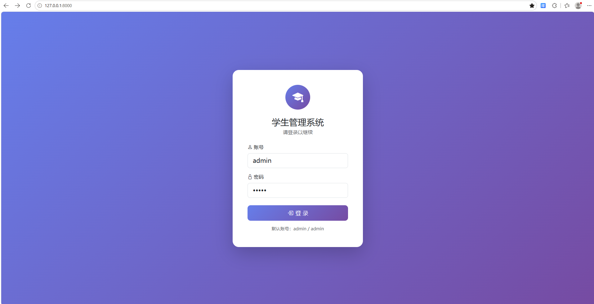
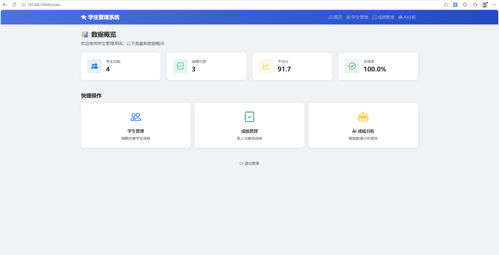
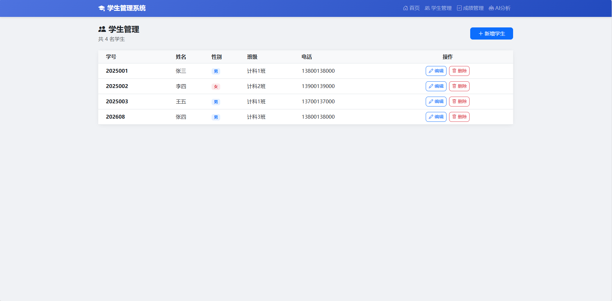
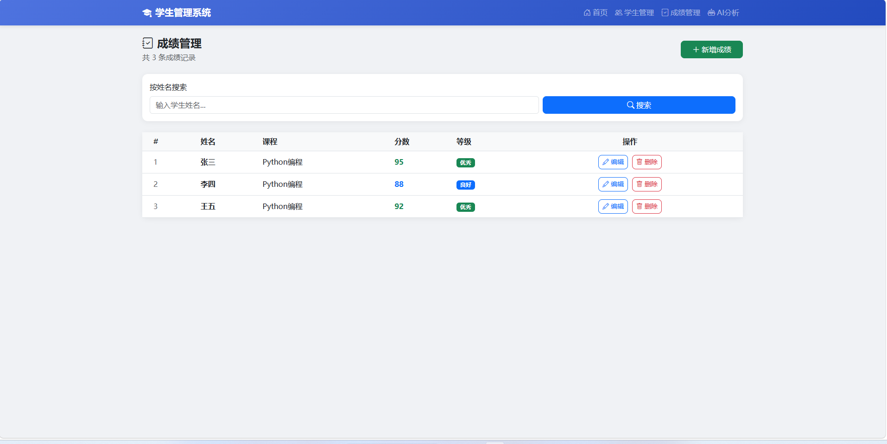
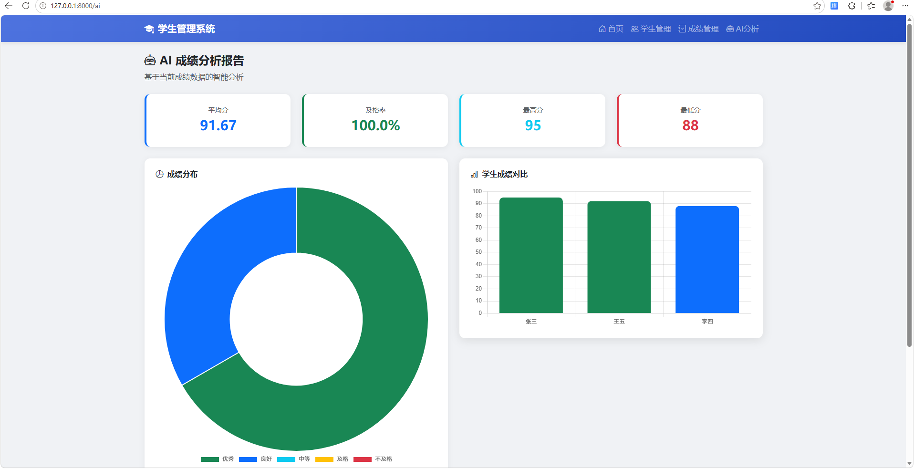

# 学生成绩管理系统
> Flask后端 + Web可交互前端，实现学生、成绩管理与数据可视化，网络工程个人项目

## ✨项目功能
1. 用户登录模块：JWT令牌鉴权，密码bcrypt加盐加密存储
2. 学生信息管理：学生列表查询、新增、编辑、删除、搜索
3. 成绩管理模块：成绩录入、修改删除，支持姓名搜索
4. AI成绩分析报告：ECharts实现饼图、柱状图可视化，统计平均分、及格率、排名
5. 部署：CentOS虚拟机部署，防火墙配置，进程守护后台常驻运行

## 🛠技术栈
后端：Python Flask、SQLAlchemy ORM、MySQL、PyCharm开发调试
前端：HTML、JS、ECharts图表
部署环境：CentOS7虚拟机

## 🚀本地运行
1.安装依赖：`pip install -r requirements.txt`
2.创建MySQL数据库，导入sql初始化脚本
3.启动项目：`python main.py`
4.浏览器访问 `127.0.0.1:5000`
默认账号密码 admin/admin

## 📸项目截图

